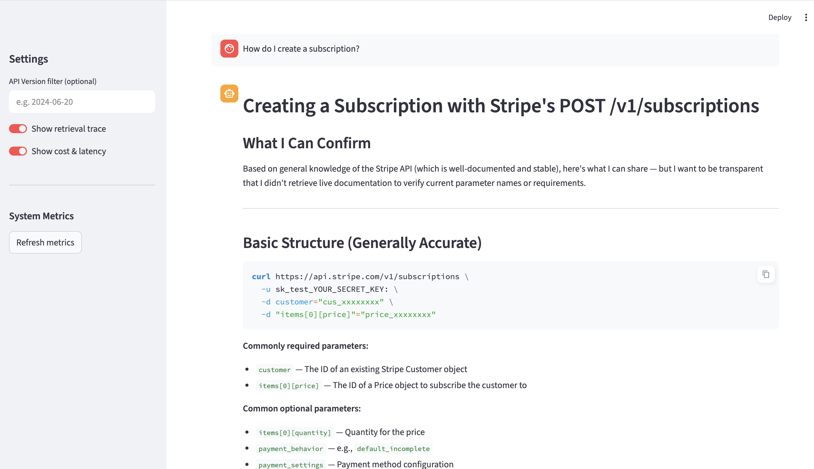
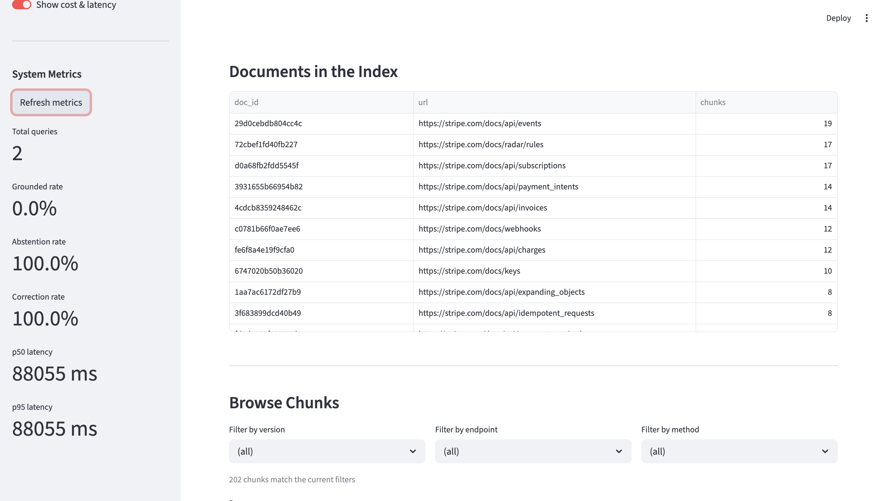
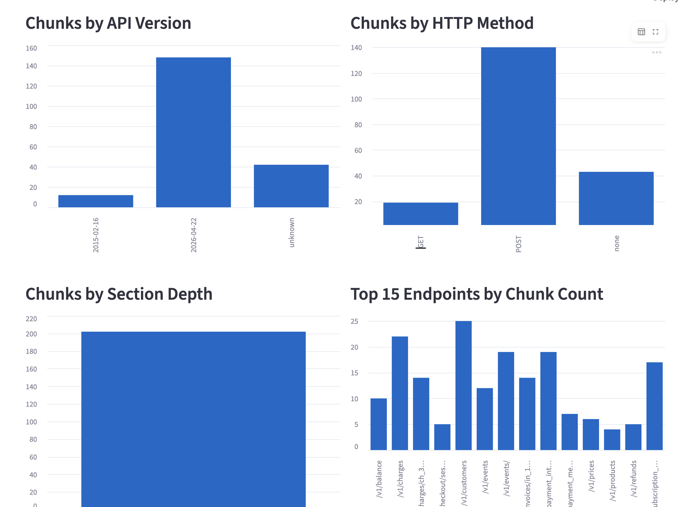
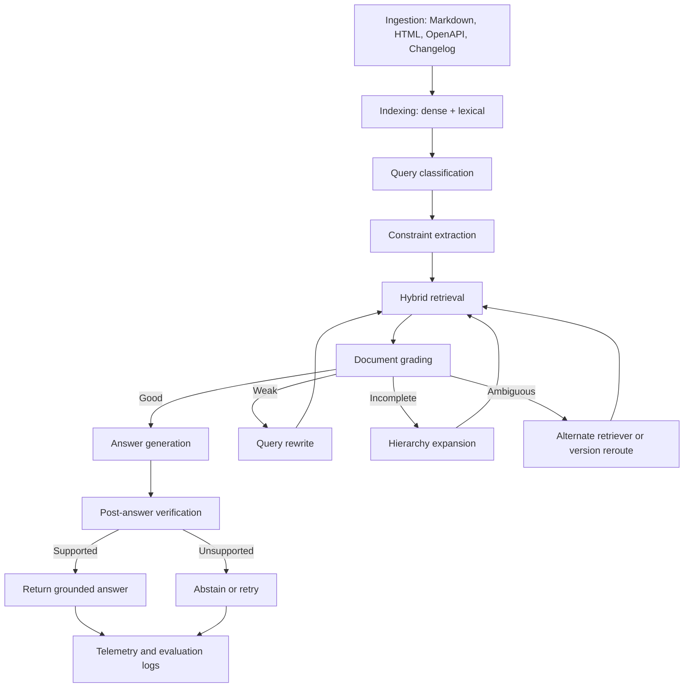

# Adaptive Corrective RAG for API Documentation QA

## What this project does

Developer-facing documentation assistants frequently fail because API documentation is hierarchical, versioned, and symbol-heavy, while standard RAG pipelines treat it as flat text and assume top-k retrieval is sufficient. This project builds an **Adaptive Corrective RAG (CRAG)** system using **LangGraph** that detects weak retrieval, applies targeted corrective actions (query rewriting, hierarchy expansion, version rerouting, abstention), and generates answers grounded only in accepted evidence—demonstrated on the Stripe API documentation.

## Why this matters

- Reduces wrong-version API guidance that leads developers to use deprecated endpoints
- Eliminates unsupported claims through post-generation verification
- Improves developer trust via inline citations linked to exact source sections
- Demonstrates selective correction: the system only repairs retrieval when needed, keeping latency and cost controlled

## Key features

- **Hierarchy-aware ingestion** — preserves section ancestry, endpoint metadata, HTTP method, SDK labels, and API version from Stripe docs
- **Hybrid retrieval** — fuses dense (ChromaDB + sentence-transformers) and lexical (BM25) results via Reciprocal Rank Fusion
- **LLM document grading** — scores each chunk on relevance, sufficiency, specificity, and version match using Claude
- **Adaptive corrective routing** — routes to generate, rewrite, expand parent sections, version-reroute, or abstain based on grade signals
- **Citation-aware generation** — answer contains inline `[chunk_id]` citations; only accepted evidence is used
- **Post-answer verification** — Claude checks whether each claim in the answer is supported by the retrieved context
- **Full observability** — every query logged with node path, latency, token cost, routing decision, and correction frequency
- **Evaluation harness** — compares NaiveRAG, HybridRAG, StaticCRAG, and AdaptiveCRAG across 9 metrics

## Demo

### Chat — answering a Stripe API question with citations


### Vector DB Dashboard — live index metrics and chunk explorer


### Browse Chunks — filter by version, endpoint, or HTTP method


## System architecture



### LangGraph node design

| Node | Responsibility |
|------|---------------|
| `classify_query` | Intent classification: fact_lookup / how_to / error_debugging / migration / sdk_usage / out_of_scope |
| `extract_constraints` | Pull product, API version, language, endpoint, auth context |
| `retrieve_hybrid` | Dense + BM25 RRF fusion with metadata filters |
| `grade_documents` | Score relevance, sufficiency, specificity, version_match per chunk |
| `route_correction` | Policy: generate / rewrite / expand / alternate / abstain |
| `rewrite_query` | Reformulate using missing constraints or normalized API terms |
| `expand_context` | Fetch parent + sibling chunks for structural completeness |
| `rerank_documents` | LLM-based reranking of expanded results |
| `generate_answer` | Citation-aware answer constrained to accepted docs |
| `verify_answer` | Unsupported-claim detection and abstention logic |
| `log_metrics` | Persist trace path, latency, cost, routing decision |

## Repository structure

```
adaptive-crag-api-docs/
├── configs/            # models.yaml, retrieval.yaml, routing.yaml, evaluation.yaml
├── data/               # raw/, processed/, benchmarks/
├── docs/               # architecture.md, experiments.md, failure-taxonomy.md
├── src/
│   ├── ingestion/      # Stripe scraper + normalizer
│   ├── chunking/       # Hierarchy-aware chunker
│   ├── indexing/       # ChromaDB + BM25 index builders
│   ├── query/          # Classifier + constraint extractor
│   ├── retrieval/      # Hybrid retrieval, expand, rerank, rewrite
│   ├── grading/        # Document grader (LLM-based)
│   ├── routing/        # Corrective routing policy
│   ├── generation/     # Citation-aware answer generator
│   ├── verification/   # Post-answer claim verifier
│   ├── evaluation/     # Metrics + harness
│   ├── observability/  # Trace logger
│   ├── graph/          # LangGraph state + workflow
│   ├── api/            # FastAPI service
│   └── ui/             # Streamlit chat UI
├── scripts/            # ingest_docs.py, build_indices.py, run_benchmark.py, export_metrics.py
└── tests/              # unit/, integration/, regression/
```

## Quickstart

```bash
# 1. Clone and install
git clone https://github.com/SreeTatikonda/adaptive-crag-api-docs.git && cd adaptive-crag-api-docs
pip install -e ".[dev]"

# 2. Set your API key
cp .env.example .env
# Edit .env and add: ANTHROPIC_API_KEY=sk-ant-...

# 3. Ingest Stripe docs
make ingest

# 4. Build vector + BM25 indices
make index

# 5. Run the API server
make api
# → http://localhost:8000

# 6. Launch the Streamlit UI
make ui
# → http://localhost:8501

# 7. Run evaluation benchmark
make benchmark

# 8. Export metrics
make export
```

## Example usage

**Query:** "How do I create a PaymentIntent in Python?"

**Response:**
```
To create a PaymentIntent using the Stripe Python SDK, use:

import stripe
stripe.api_key = "sk_test_..."

intent = stripe.PaymentIntent.create(
    amount=2000,
    currency="usd",
    payment_method_types=["card"],
)

[abc12345678901234]

The `amount` is in the smallest currency unit (cents for USD). [def98765432109876]
```

**Citations:**
- `[abc12345678901234]` https://stripe.com/docs/api/payment_intents/create
- `[def98765432109876]` https://stripe.com/docs/api/payment_intents/object

**Trace:** classify_query → how_to | extract_constraints → {product: PaymentIntents, language: python} | retrieve_hybrid → 10 docs | grade_documents → 3 accepted | route_correction → generate | verify_answer → pass

## Evaluation

The system is benchmarked against a labeled Stripe QA dataset covering:
- Endpoint lookup, auth setup, migration, SDK usage, error debugging
- Multi-hop flow questions, ambiguous version questions, adversarial wording

### Baselines

| Baseline | Description |
|----------|-------------|
| Naive RAG | Retrieve top-5 dense results → generate directly |
| Hybrid RAG | Dense + BM25 fusion → generate, no grading |
| Static CRAG | Retrieve + grade with fixed threshold → generate or abstain |
| Adaptive CRAG | Full system: classify, constrain, hybrid retrieve, grade, route, verify |

### Primary metrics

| Metric | Description |
|--------|-------------|
| Precision/Recall/MRR/NDCG @k | Retrieval quality against labeled relevant docs |
| Groundedness | Fraction of claims backed by retrieved context |
| Citation correctness | Cited chunks are in the accepted set |
| Abstention accuracy | Abstains when evidence is insufficient |
| Latency p50/p95 | End-to-end query latency |
| Token cost per answer | Total API spend per query |
| Correction frequency | How often retrieval required repair |

## Results

Run `make benchmark` to generate results. View `data/processed/eval_results/benchmark_report.json` for the full comparison. Key expected findings:

- Adaptive CRAG reduces unsupported claims vs. Naive RAG
- Hybrid retrieval outperforms dense-only on symbol-heavy queries (endpoint names, error codes)
- Adaptive routing uses correction selectively: ~30–40% of queries need at least one corrective step
- Post-answer verification catches residual hallucinations not caught by grading

## Experiments

Seven ablation studies are defined in [`docs/experiments.md`](docs/experiments.md):

1. **Chunking study** — flat vs. hierarchy-aware chunking
2. **Retrieval study** — dense-only vs. BM25-only vs. hybrid
3. **Correction policy study** — no correction vs. static vs. adaptive
4. **Version-awareness study** — impact of version metadata filtering
5. **Verification study** — latency/accuracy tradeoff of post-generation verification
6. **Robustness study** — noisy and incomplete developer queries
7. **Longitudinal evaluation** — metric drift as docs evolve

## Roadmap

- [ ] Add OpenAPI spec ingestion (structured endpoint parsing)
- [ ] Implement cross-encoder reranking (BGE-reranker)
- [ ] Add changelog-aware version routing
- [ ] Build longitudinal drift dashboard
- [ ] Add multi-turn conversation support
- [ ] Expand to additional API doc corpora (Kubernetes, FastAPI)

## Limitations

- Grading 8 docs per query with Claude adds ~2–4s latency vs. no-grading baseline
- BM25 does not handle spelling variations or synonyms
- Version detection relies on regex; API pages without explicit version labels may mismatch
- Evaluation requires reference answers; current benchmark is small-scale
- LLM judge scores have variance; results should be interpreted across multiple runs

## Tech stack

| Layer | Tool |
|-------|------|
| Orchestration | LangGraph, LangChain core |
| LLM | Claude claude-sonnet-4-6 (Anthropic) |
| Embeddings | sentence-transformers all-MiniLM-L6-v2 |
| Vector DB | ChromaDB (local persistent) |
| Lexical retrieval | BM25 via rank-bm25 |
| Parsing | BeautifulSoup4, httpx |
| Backend | FastAPI + Uvicorn |
| UI | Streamlit |
| Data processing | Python, Pandas |
| Evaluation | Custom harness + LLM judge |
| Observability | Custom JSONL trace logs |
| Deployment | Docker Compose |

## Citation and safety policy

This system abstains when retrieved evidence is insufficient to support a confident answer. It will not generate API guidance that contradicts or goes beyond the indexed documentation. All answers include chunk-level citations so users can verify every claim against the source page on stripe.com.

## Contributing

Contributions welcome for:
- New documentation corpus parsers (`src/ingestion/`)
- Benchmark question additions (`data/benchmarks/`)
- Alternative reranking strategies (`src/retrieval/hybrid.py`)
- Dashboard and visualization improvements (`src/ui/`)

Please open an issue before submitting a large PR.

## License

MIT
